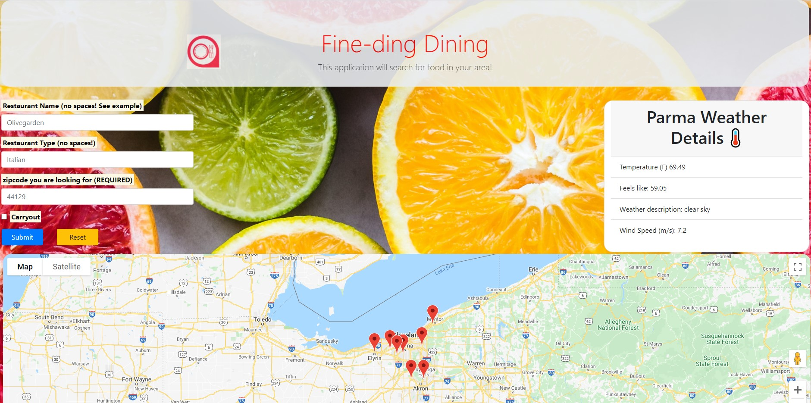

# Restaurant Finder

## Description 

The application requests the user to input some details in the search bar: the name of the restaurant they're looking for, the cuisine style of a restaurant they're looking for, and/or if a restaurant has carryout functionality.

The application will also require the user to input their zipcode, to best approximate the user's location.

## User Story

Enter all of the information requested into the search form.

Information for the weather will pop up for the area in question.

Markers will pop up on the map in regards to the restaurants being searched, to a maximum of 15 results.

To reset the app, click the reset button and re-enter the data.

### App screenshot

   

## Table of contents

- [Description](#Description)
- [Usage](#Usage)
- [Technologies](#Technologies)
- [Licence](#Licence)
- [Repository Link](#Repository)
- [GitHub Info](#GitHub) 

## Usage

Go to [Restaurant Finder](https://morrow7564.github.io/Restaurant-Finder/) 

## Technologies
* HTML
* JavaScript
*  API's used:
    Zomato
    OpenWeatherMap
    Google Maps

## Licence

## Repository

- [Project Repo](https://github.com/morrow7564/Restaurant-Finder)

## GitHub

- Christopher Morrow
- [GitHub Profile](https://github.com/morrow7564)

